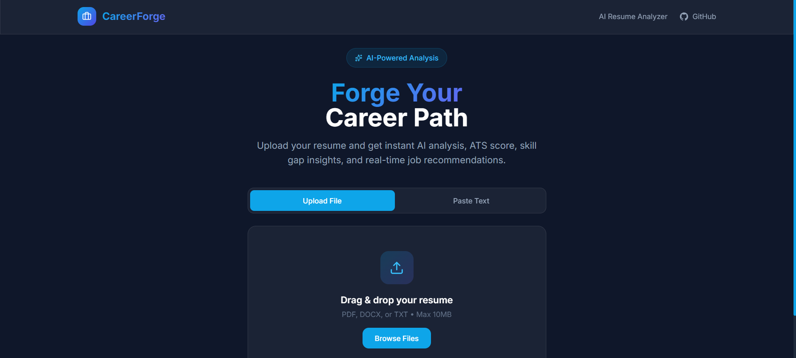
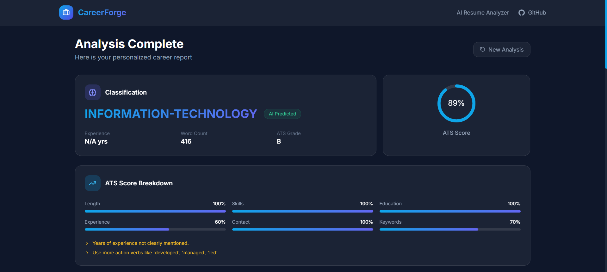
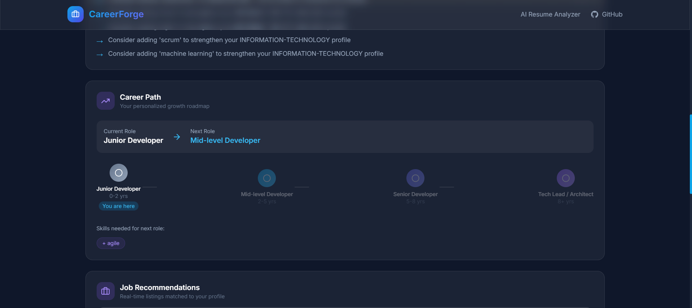
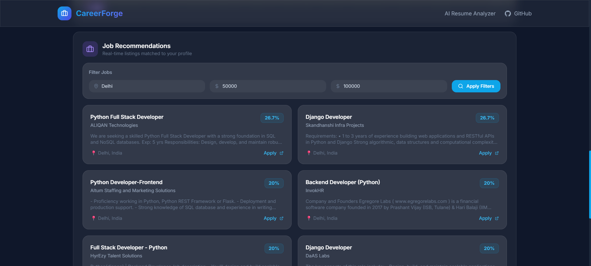

<div align="center">



# ⚒️ CareerForge

### AI-Powered Resume Analysis & Job Recommendation System

[](https://python.org)
[](https://fastapi.tiangolo.com)
[](https://reactjs.org)
[](https://tailwindcss.com)
[](https://scikit-learn.org)
[](https://github.com/madhan1945)

**Upload your resume → Get instant AI analysis → Land your dream job**

[🚀 Live Demo](#) · [📖 API Docs](#api-documentation) · [🐛 Report Bug](https://github.com/madhan1945/CareerForge/issues)

</div>

---

## ✨ What is CareerForge?

CareerForge is a full-stack AI-powered platform that analyzes resumes, scores them for ATS compatibility, identifies skill gaps, suggests career paths, and recommends real-time job listings — all in seconds.

---

## 🖼️ Screenshots

<div align="center">

### 🏠 Homepage


### 📊 Analysis Dashboard


### 🗺️ Career Path Roadmap


### 💼 Job Recommendations


</div>

---

## 🚀 Features

### Core
- 🤖 **Resume Classification** — ML model trained on 2,484 resumes across 24 categories
- 📄 **Resume Parser** — Upload PDF, DOCX, or TXT files
- 🎯 **ATS Scoring** — Grade your resume for applicant tracking systems
- 🔍 **Skill Extraction** — Auto-detect 50+ technical and soft skills

### Advanced
- 📊 **Skill Gap Analysis** — Compare your skills vs job requirements
- 🗺️ **Career Path Roadmap** — Personalized growth trajectory
- 💡 **Improvement Suggestions** — AI-driven resume recommendations
- 🌐 **Real-Time Job Recommendations** — Live listings from Adzuna API
- 🏆 **Job Match Scoring** — Rank jobs by relevance to your profile
- 🔎 **Job Filters** — Filter by location and salary range

---

## 🏗️ Architecture
CareerForge/
├── backend/                    # FastAPI Python Backend
│   └── app/
│       ├── api/routes.py       # API endpoints
│       ├── models/             # ML classifier
│       ├── nlp/                # Preprocessing pipeline
│       └── services/           # Business logic
│           ├── resume_parser   # PDF/DOCX parsing
│           ├── skill_gap       # Skill gap analysis
│           ├── ats_scorer      # ATS compatibility
│           ├── job_recommender # Adzuna API integration
│           └── career_path     # Career roadmap
├── frontend/                   # React + Vite + TailwindCSS
│   └── src/
│       ├── components/         # UI components
│       └── utils/api.js        # API client
├── data/
│   ├── raw/                    # Kaggle dataset
│   ├── processed/              # Preprocessed CSVs
│   └── models/                 # Trained ML models
└── notebooks/                  # EDA & experiments

---

## 🛠️ Tech Stack

| Layer | Technology |
|-------|-----------|
| Backend | FastAPI, Python 3.11 |
| ML/NLP | scikit-learn, spaCy, NLTK |
| Frontend | React 18, Vite, TailwindCSS |
| Job API | Adzuna REST API |
| ML Model | TF-IDF + LinearSVC (F1: 0.71) |
| Charts | Recharts, react-circular-progressbar |

---

## ⚙️ Local Setup

### Prerequisites
- Python 3.11
- Node.js 18+
- Git

### Backend Setup
```bash
cd backend
python -m venv venv
venv\Scripts\activate        # Windows
pip install -r requirements.txt
python -m spacy download en_core_web_sm
```

Create `.env` file in `backend/`:
```env
ADZUNA_APP_ID=your_app_id
ADZUNA_APP_KEY=your_app_key
ADZUNA_COUNTRY=in
```

Train the model:
```bash
python train_classifier.py
```

Run the server:
```bash
uvicorn app.main:app --reload
```

### Frontend Setup
```bash
cd frontend
npm install
npm run dev
```

Open 👉 http://localhost:5173

---

## 📡 API Documentation

Base URL: `http://localhost:8000/api/v1`

| Method | Endpoint | Description |
|--------|----------|-------------|
| POST | `/analyze-and-recommend` | Full resume analysis + jobs |
| POST | `/upload` | Upload PDF/DOCX resume |
| POST | `/classify` | Classify resume category |
| POST | `/jobs/search` | Search jobs with filters |
| GET | `/categories` | Get all job categories |

Full interactive docs: 👉 http://localhost:8000/docs

---

## 📊 Model Performance

| Model | Accuracy | F1 Score |
|-------|----------|----------|
| Logistic Regression | 64.8% | 0.627 |
| **LinearSVC (Best)** | **72.2%** | **0.712** |

Trained on 2,484 resumes across 24 job categories from Kaggle.

---

## 🗓️ Development Timeline

| Day | What was built |
|-----|---------------|
| Day 1 | Project setup, EDA, preprocessing pipeline |
| Day 2 | ML classifier (TF-IDF + LinearSVC), FastAPI skeleton |
| Day 3 | Resume parser, skill gap analyzer, ATS scorer |
| Day 4 | Adzuna job recommendations, match scoring |
| Day 5 | React frontend, drag & drop upload, results dashboard |
| Day 6 | Career path roadmap, job filters, UI polish |
| Day 7 | README, deployment prep |

---

<div align="center">

Built by [madhan1945](https://github.com/madhan1945)

</div>